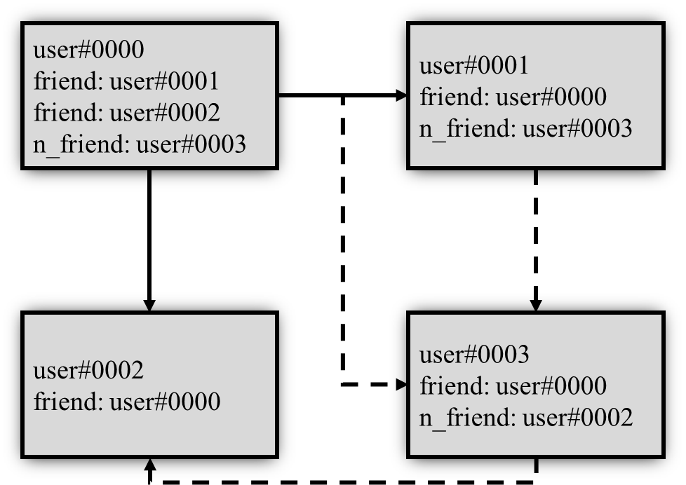
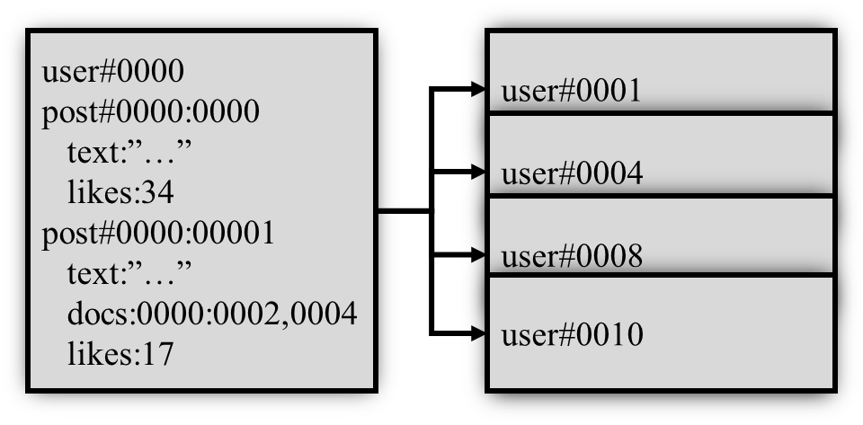
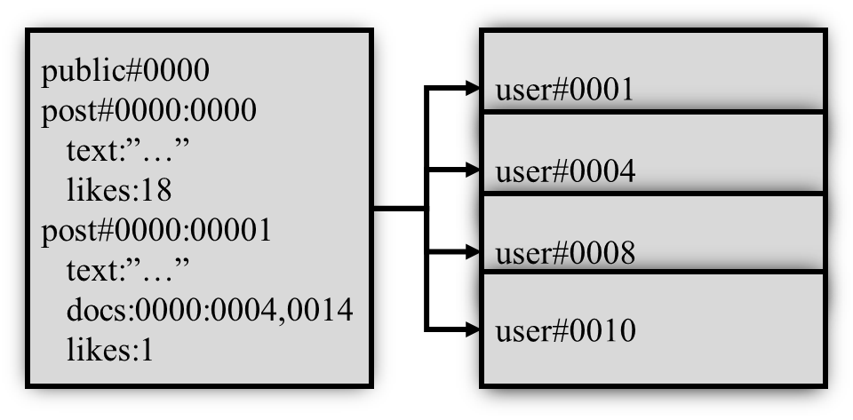
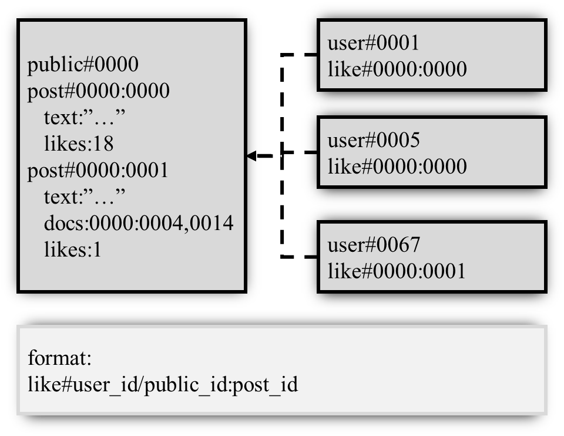

# Пояснительная записка

## 0.Введение

ПИШЕТСЯ В КОНЦЕ

## 1.Анализ ТЗ

### 1.1.Формулировка задания на КР

Целью курсовой работы является проектирование и реализация базы данных "Данные социальной сети". Курсовой проект отражает этапы создания базы данных с использованием СУБД FireBird 2.5, а также клиентского приложения. Для того, чтобы выполнить поставленную цель, были сформулированны следующие задачи:

1. Провести анализ предметной области.
2. Разработать формальные требования к хранимым в БД данным.
3. Разработать структуру БД.
4. Разработать клиентское приложение.

### 1.2.Описание предметной области

Социальная сеть должна реализовывать функционал взаимодействия зарегистрированных в ней пользователей. Поэтому база данных "Данные социальной сети" должна хранить данные, позволяющие обеспечить следующие (необходимые и достаточные для функционирования сети) возможности:

1. Создание, настройка и просмотр (получение данных) личной страницы пользователя. Просмотр предусматривает скрытие некоторых данных в соответствии с настройками приватности. Для данных процессов (не включая настройки приватности) необходимо хранить такие данные, как:
    * Уникальный идентификатор
    * Фамилия
    * Имя
    * Изображение пользователя (аватар)
    * Пол
    * Дата рождения
    * Страна
    * Город
    * Телефон
    * Информация "О себе"
    * Пароль (в зашифрованном виде)
2. Настройки приватности и пользовательского интерфейса. Для этих процессов необходимо хранить следующие данные:
    * Отображение пола (для всех пользователей, всех друзей, никому или избранным пользователям из списка друзей)
    * Отображение даты рождения (аналогичные варианты)
    * Возможность просмотра увеличенного аватара (аналогичные варианты)
    * Возможность просмотра списка друзей (аналогичные варианты)
    * Возможность просмотра списка групп (аналогичные варианты)
    * Возможность просмотра записей на странице (аналогичные варианты)
    * Возможность отправления сообщений (аналогичные варианты)
    * Отображение уведомлений в приложении (отображать или не отображать)
    * Воспроизводить звук уведомлений (воспроизводить или нет)
    * Отображать содержание уведомлений (отображать или скрывать)
3. Взаимодействие пользователя с другими пользователями и личной страницей (за исключением взаимодействия с группами, документами и сообщениями): добавлние новых друзей (с подтверждением со стороны пользователя, которому отправлен запрос на добавление в друзья), удаление друзей (в одностороннем порядке), оценка (оценка может либо быть, либо отсутствовать) записей на страницах других пользователей, добавление записей на свою страницу, загрузка и прикрепление к создаваемой записи аудио, видео, изображения или иного документа. Для этих процессов необходимы такие данные:
    * Список добавленных друзей
    * Список друзей, которым отправлен запрос на добавление в друзья
    * Идентификаторы записей на странице
    * Текст для каждой записи на странице
    * Прикрепленные к каждой записи на странице документы
    * Количество оценок к записи на странице
    * Идентификаторы оцененных записей
4. Взаимодействие пользователей с группами: создание группы, настройка группы (администрирование), добавление записей в группу, загрузка и прикрепление к создаваемым записям документов, оценка записей группы, вступление в группу (не требует подтверждения), выход из группы (не требует подтверждения). Настройки приватности для системы групп не предусматриваются. Для процессов, описанных выше, нужны следующие данные:
    * Уникальный идентификатор
    * Название группы
    * Изображение группы (аватар)
    * Идентификатор пользователя, создавшего группу (только ему доступна возможность выкладывать записи на страницу группы)
    * Список групп, на которые подписан пользователь (для каждого пользователя)
    * Список пользователей, которые подписаны на группу (для каждой группы)
    * Идентификаторы записей на странице
    * Текст для каждой записи на странице
    * Прикрепленные к каждой записи на странице документы
    * Количество оценок к записи на странице
    * Информация "О группе"
5. Взаимодействие пользователей с другими пользователями посредством отправки личных сообщений. Для этого процесса необходимы такие данные:
    * Сообщения (включая указатели на документы), отправленные другому пользователю
    * Документы, отправленные другому пользователю
6. Взаимодействие пользователя с системой документов: загрузка документа напрямую в общее хранилище документов (предусматривается открытый доступ), загрузка документа на страницу, загрузка документа в группу, загрузка документа в личную переписку с другим пользователем. Для перечисленных процессов необходимо хранить следующие данные:
    * Файлы документов, загруженных в общее хранилище, с указанием идентификатора загрузившего
    * Идентификаторы документов, загруженных конкретным пользователем в общее хранилище
    * Файлы документов, загруженных на страницу пользователя
    * Идентификаторы документов, загруженных на страницу пользователя
    * Файлы документов, загруженных на страницу группы
    * Идентификаторы документов, загруженных на страницу группы

Клиентское приложение, реализующее доступ к создаваемой базе данных, должно обеспечивать его с помощью системы страниц:

1. Личная страница
2. Настройки
3. Друзья
4. Поиск пользователей
5. Группы
6. Поиск групп
7. Загруженные (общие) документы
8. Поиск документов

### 1.3.Движение потоков данных

Для обеспечения функционирования социальной сети необходим обмен данных.

Первоначально пользователи создают и настраивают свои страницы. Затем происходят несколько процессов:

* Пользователи добавляют друг друга в друзья, обмениваясь запросами
* Пользователи отправляют друг другу сообщения, обмениваясь текстовой информацией и документами друг с другом
* Пользователи добавляют на свою страницу записи, прикрепляя или не прикрепляя к ним документы, таким образом обмениваясь ими сразу со всеми пользователями, которые могут просматривать эти записи согласно настройкам приватности пользователя, добавившего запись
* Пользователи ставят (либо убирают) оценки на записи на страницах других пользователей, таким образом обмениваясь информацией об одобрении соответствующих записей с остальными пользователями, которые могут видеть эти записи согласно настройкам приватности
* Пользователи добавляют в общее хранилище документы, таким образом обмениваясь ими со всеми
* Пользователи создают группы и добавляют на их стены записи, таким образом обмениваясь ими с подписанными на соответствующие группы пользователями
* Пользователи ставят (либо убирают) оценки  на записи на страницах групп, аким образом обмениваясь информацией об одобрении соответствующих записей с остальными пользователями, которые подписаны на эти группы

Таким образом, можно визуально представить обмен данными между пользователями.

Обмен списком друзей

Обмен сообщениями

Обмен записями на личной странице

Обмен записями на странице группы

Обмен оценками

### 1.4.Обзор аналогов

#### 1.4.1.ВКонтакте

Внешний вид сайта ВКонтакте

ВКонтакте — российская социальная сеть. Сайт особенно популярен среди русскоязычных пользователей. Запущенный 10 октября 2006 года, ресурс изначально позиционировал себя в качестве социальной сети студентов и выпускников российских вузов, позднее стал называть себя «современным, быстрым и эстетичным способом общения в сети». По данным на август 2017 года, среднесуточная аудитория составляет более 80 миллионов посетителей, зарегистрировано более 460 миллионов пользователей. По данным SimilarWeb на сентябрь 2019 года, сайт ВКонтакте занимал 12 место по популярности в мире.

ВКонтакте позволяет:

1. Создавать, настраивать и просматривать личные страницы. Поддерживается описание личной жизни вплоть до образования, карьеры и воинской службы. В качестве средства защиты от нежелательного доступа используется привязка к номеру телефона, пароль, система двухфакторной аутентификации
2. Поддерживается гибкая настройка приватности личной страницы, пользовательского интерфейса в целом и системы уведомлений в частности
3. Взаимодействовать с другими пользователями сети множеством способов: добавлять их в друзья, настраивать родственные связи, отправлять сообщения, приглашения в группы и события и т.д.
4. Создавать и администрировать группы (формально подразделяемые на несколько видов по типу администрирования)
5. Ставить оценки в виде есть оценка - нет оценки ("лайки")

## 2.Проектировние базы данных

### 2.1.Создание базы данных

#### 2.1.1.Пользователь

| id | Фамилия | Имя | Аватар | Пол | ДР | Страна | Город | Телефон | О себе |
| -  | -       | -   | -      | -   | -  | -      | -     | -       | -      |
| 1  | q       | w   | img    | m   | 1  | r      | m     | 1       | 1      |

#### 2.1.2.Пароли (шифрованное)

| id | Пароль |
| -  | -      |
| 1  | qqq    |

#### 2.1.3.Настройки приватности

| id | О.Пол | О.ДР | О.Аватар | О.Друзья | О.Группы | О.Записи | О.Сообщения |
| -  | -     | -    | -        | -        | -        | -        | -           |
| 1  | 0     | 0    | 0        | 0        | 0        | 0        | 1           |

#### 2.1.4.Настройки GUI

| id | Уведомления | Звуки | Содержимое |
| -  | -           | -     | -          |
| 1  | 0           | 1     | 0          |

#### 2.1.5.Группы

| id | Название | Аватар | id пользователя | О группе |
| -  | -        | -      | -               | -        |
| 2  | t        | img    | 1               | ttt      |

#### 2.1.6.Список друзей

| id | id друга |
| -  | -        |
| 1  | 3        |

#### 2.1.7.Список заявок на добавление в друзья

| id | id друга на добавление |
| -  | -                      |
| 1  | 4                      |

#### 2.1.8.Список подписок

| id пользователя | id группы |
| -               | -         |
| 1               | 2         |
| 4               | 2         |

#### 2.1.9.Записи пользователя или группы

| id пользователя/группы | id записи |
| -                      | -         |
| 1                      | 1         |

#### 2.1.10.Записи

| id записи | Текст записи | Количество оценок |
| -         | -            | -                 |
| 1         | yyy          | 14                |

#### 2.1.11.Прикрепленные к записи документы

Ограничение - 10 документов на одну запись.

| id записи | Документ 1 | ... | Документ 10 |
| -         | -          | -   | -           |
| 1         | y.jpg      | ... | null        |

#### 2.1.12.Загруженные в общее хранилище документы

Загруженные в общее хранилище документы нельзя прикрепить к записи или сообщению.

| id документа | id пользователя | Документ |
| -            | -               | -        |
| 1            | 1               | kiss.mp3 |

#### 2.1.13.Оцененные записи

| id пользователя | id записи |
| -               | -         |
| 1               | 1         |

#### 2.1.14.Сообщения

Ограничение - 10 документов на одно сообщение.

| id исходящее | id назначения | id сообщения | Текст | Документ 1 | ... | Документ 10 |
| -            | -             | -            | -     | -          | -   | -           |
| 1            | 3             | 1            | q     | yoyo.jpg   | -   | null        |

### 2.2.Приведение базы данных к первой нормальной форме

#### 2.2.1.Определение

Отношение находится в первой нормальной форме, если все его атрибуты имеют единственное значение.

#### 2.2.2.Пример 1

Отношение, не приведенное к первой нормальной форме:

| № | ФИО       | Подразделение |
| - | -         | -             |
| 1 | Каратанов | 1, 105        |
| 2 | Крицкий   | 1, 105        |
| 3 | Брега     | 1, 104        |

Отношение, приведенное к первой нормальной форме:

| № | ФИО       | Факультет | Кафедра |
| - | -         | -         | -       |
| 1 | Каратанов | 1         | 105     |
| 2 | Крицкий   | 1         | 105     |
| 3 | Брега     | 1         | 104     |

#### 2.2.3.Пример 2

Пусть небольшой фирме, продающей комплектующие для компьютеров, требуется сохранять данные о заказах. Эти данные включают: 1) дату заказа; 2) номер заказа; 3) артикул (уникальный номер единицы товара); 4) наименование товара; 5) цену заказанного товара.

##### 2.2.3.1.Заказы

| дата  | Номер заказа | Артикул | Наименование | Цена |
| -     | -            | -       | -            | -    |
| 1 фев | 1            | 1672    | Процессор    | 175  |
| 1 фев | 1            | 5301    | ASUS         | 145  |
| 1 фев | 2            | 1158    | 256 MB       | 114  |

Отношение находится в первой нормальной форме, так как все его атрибуты атомарны.

### 2.3.Приведение базы данных ко второй нормальной форме

#### 2.3.1.Определение

Отношение находится во второй нормальной форме, если оно находится в первой нормальной форме и каждый неключевой атрибут функционально полно зависит от первичного ключа.

Для устранения частичной зависимости и перевода отношения во вторую нормальную форму необходимо, используя операцию проекции, разложить его на несколько отношений следующим образом:

* построить проекцию без атрибутов, находящихся в частичной функциональной зависимости от первичного ключа;
* построить проекции на части составного первичного ключа и атрибуты, зависящие от этих частей.

#### 2.3.2.Пример (продолжение 2.2.3)

Для того, чтобы выполнить требования второй нормальной формы, надо добавить к таблице атрибут, который однозначно бы идентифицировал каждую единицу товара, входящую в заказ. Пусть этим атрибутом будет Учетный №. В этой таблице все атрибуты зависят от атрибута Учетный №, но есть зависимость Наименования и Цены от Артикула, то есть требование третьей нормальной формы (независимости атрибутов) отношения не выполняется.

##### 2.3.2.1.Заказы

| Учетный № | дата  | Номер заказа | Артикул | Наименование | Цена |
| -         | -     | -            | -       | -            | -    |
| 1         | 1 фев | 1            | 1672    | Процессор    | 175  |
| 2         | 1 фев | 1            | 5301    | ASUS         | 145  |
| 3         | 1 фев | 2            | 1158    | 256 MB       | 114  |

#### 2.4.Приведение базы данных к третьей нормальной форме

#### 2.4.1.Определение

Отношение находится в третьей нормальной форме, если оно находится во второй нормальной форме и каждый неключевой атрибут нетранзитивно (напрямую) зависит от первичного ключа.

#### 2.4.2.Пример (продолжение 2.3.2)

Для приведения отношения в третью нормальную форму предыдущее отношение требуется разбить на три отношения: Продажи, Комплектующие, Цены.

##### 2.4.2.1.Продажи

| Учетный № | дата  | Номер заказа | Артикул |
| -         | -     | -            | -       |
| 1         | 1 фев | 1            |  1672   |
| 2         | 1 фев | 1            |  5301   |
| 3         | 1 фев | 2            |  1158   |

##### 2.4.2.2.Комплектующие

| Артикул | Наименование |
| -       | -            |
| 1672    |  Процессор   |
| 5301    |  ASUS        |
| 1158    |  256 MB      |

##### 2.4.2.3.Цены

| Артикул | Цена |
| -       | -    |
| 1672    | 175  |
| 5301    | 145  |
| 1158    | 114  |
