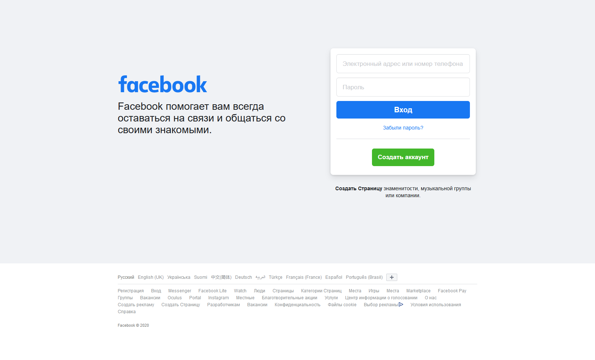

# Пояснительная записка

## 0.Введение

ПИШЕТСЯ В КОНЦЕ

## 1.Анализ ТЗ

### 1.1.Формулировка задания на КР

Целью курсовой работы является проектирование и реализация базы данных "Данные социальной сети". Курсовой проект отражает этапы создания базы данных с использованием СУБД FireBird 2.5, а также клиентского приложения. Для того, чтобы выполнить поставленную цель, были сформулированны следующие задачи:

1. Провести анализ предметной области.
2. Разработать формальные требования к хранимым в БД данным.
3. Разработать структуру БД.
4. Разработать клиентское приложение.

### 1.2.Описание предметной области

Социальная сеть должна реализовывать функционал взаимодействия зарегистрированных в ней пользователей. Поэтому база данных "Данные социальной сети" должна хранить данные, позволяющие обеспечить следующие (необходимые и достаточные для функционирования сети) возможности:

1. Создание, настройка и просмотр (получение данных) личной страницы пользователя. Просмотр предусматривает скрытие некоторых данных в соответствии с настройками приватности. Для данных процессов (не включая настройки приватности) необходимо хранить такие данные, как:
    * Уникальный идентификатор
    * Фамилия
    * Имя
    * Изображение пользователя (аватар)
    * Пол
    * Дата рождения
    * Страна
    * Город
    * Телефон
    * Информация "О себе"
    * Пароль (в зашифрованном виде)
2. Настройки приватности и пользовательского интерфейса. Для этих процессов необходимо хранить следующие данные:
    * Отображение пола (для всех пользователей, всех друзей, никому или избранным пользователям из списка друзей)
    * Отображение даты рождения (аналогичные варианты)
    * Возможность просмотра увеличенного аватара (аналогичные варианты)
    * Возможность просмотра списка друзей (аналогичные варианты)
    * Возможность просмотра списка групп (аналогичные варианты)
    * Возможность просмотра записей на странице (аналогичные варианты)
    * Возможность отправления сообщений (аналогичные варианты)
    * Отображение уведомлений в приложении (отображать или не отображать)
    * Воспроизводить звук уведомлений (воспроизводить или нет)
    * Отображать содержание уведомлений (отображать или скрывать)
3. Взаимодействие пользователя с другими пользователями и личной страницей (за исключением взаимодействия с группами, документами и сообщениями): добавлние новых друзей (с подтверждением со стороны пользователя, которому отправлен запрос на добавление в друзья), удаление друзей (в одностороннем порядке), оценка (оценка может либо быть, либо отсутствовать) записей на страницах других пользователей, добавление записей на свою страницу, загрузка и прикрепление к создаваемой записи аудио, видео, изображения или иного документа. Для этих процессов необходимы такие данные:
    * Список добавленных друзей
    * Список друзей, которым отправлен запрос на добавление в друзья
    * Идентификаторы записей на странице
    * Текст для каждой записи на странице
    * Прикрепленные к каждой записи на странице документы
    * Количество оценок к записи на странице
    * Идентификаторы оцененных записей
4. Взаимодействие пользователей с группами: создание группы, настройка группы (администрирование), добавление записей в группу, загрузка и прикрепление к создаваемым записям документов, оценка записей группы, вступление в группу (не требует подтверждения), выход из группы (не требует подтверждения). Настройки приватности для системы групп не предусматриваются. Для процессов, описанных выше, нужны следующие данные:
    * Уникальный идентификатор
    * Название группы
    * Изображение группы (аватар)
    * Идентификатор пользователя, создавшего группу (только ему доступна возможность выкладывать записи на страницу группы)
    * Список групп, на которые подписан пользователь (для каждого пользователя)
    * Список пользователей, которые подписаны на группу (для каждой группы)
    * Идентификаторы записей на странице
    * Текст для каждой записи на странице
    * Прикрепленные к каждой записи на странице документы
    * Количество оценок к записи на странице
    * Информация "О группе"
5. Взаимодействие пользователей с другими пользователями посредством отправки личных сообщений. Для этого процесса необходимы такие данные:
    * Сообщения (включая указатели на документы), отправленные другому пользователю
    * Документы, отправленные другому пользователю
6. Взаимодействие пользователя с системой документов: загрузка документа напрямую в общее хранилище документов (предусматривается открытый доступ), загрузка документа на страницу, загрузка документа в группу, загрузка документа в личную переписку с другим пользователем. Для перечисленных процессов необходимо хранить следующие данные:
    * Файлы документов, загруженных в общее хранилище, с указанием идентификатора загрузившего
    * Идентификаторы документов, загруженных конкретным пользователем в общее хранилище
    * Файлы документов, загруженных на страницу пользователя
    * Идентификаторы документов, загруженных на страницу пользователя
    * Файлы документов, загруженных на страницу группы
    * Идентификаторы документов, загруженных на страницу группы

Клиентское приложение, реализующее доступ к создаваемой базе данных, должно обеспечивать его с помощью системы страниц:

1. Личная страница
2. Настройки
3. Друзья
4. Поиск пользователей
5. Группы
6. Поиск групп
7. Загруженные (общие) документы
8. Поиск документов

### 1.3.Движение потоков данных

Для обеспечения функционирования социальной сети необходим обмен данных.

Первоначально пользователи создают и настраивают свои страницы. Затем происходят несколько процессов:

* Пользователи добавляют друг друга в друзья, обмениваясь запросами
* Пользователи отправляют друг другу сообщения, обмениваясь текстовой информацией и документами друг с другом
* Пользователи добавляют на свою страницу записи, прикрепляя или не прикрепляя к ним документы, таким образом обмениваясь ими сразу со всеми пользователями, которые могут просматривать эти записи согласно настройкам приватности пользователя, добавившего запись
* Пользователи ставят (либо убирают) оценки на записи на страницах других пользователей, таким образом обмениваясь информацией об одобрении соответствующих записей с остальными пользователями, которые могут видеть эти записи согласно настройкам приватности
* Пользователи добавляют в общее хранилище документы, таким образом обмениваясь ими со всеми
* Пользователи создают группы и добавляют на их стены записи, таким образом обмениваясь ими с подписанными на соответствующие группы пользователями
* Пользователи ставят (либо убирают) оценки  на записи на страницах групп, аким образом обмениваясь информацией об одобрении соответствующих записей с остальными пользователями, которые подписаны на эти группы

### 1.4.Обзор аналогов

#### 1.4.1.ВКонтакте

Рисунок 1 — внешний вид сайта ВКонтакте

ВКонтакте — российская социальная сеть. Сайт особенно популярен среди русскоязычных пользователей. Запущенный 10 октября 2006 года, ресурс изначально позиционировал себя в качестве социальной сети студентов и выпускников российских вузов, позднее стал называть себя «современным, быстрым и эстетичным способом общения в сети». По данным на август 2017 года, среднесуточная аудитория составляет более 80 миллионов посетителей, зарегистрировано более 460 миллионов пользователей. По данным SimilarWeb на сентябрь 2019 года, сайт ВКонтакте занимал 12 место по популярности в мире.

ВКонтакте позволяет:

1. Создавать, настраивать и просматривать личные страницы. Поддерживается описание личной жизни вплоть до образования, карьеры и воинской службы. В качестве средства защиты от нежелательного доступа используется привязка к номеру телефона, пароль, система двухфакторной аутентификации
2. Поддерживается гибкая настройка приватности личной страницы, пользовательского интерфейса в целом и системы уведомлений в частности
3. Взаимодействовать с другими пользователями сети множеством способов: добавлять их в друзья, настраивать родственные связи, отправлять сообщения, приглашения в группы и события и т.д.
4. Создавать и администрировать группы (формально подразделяемые на несколько видов по типу администрирования)
5. Ставить оценки в виде есть оценка - нет оценки ("лайки")

#### 1.4.2.Facebook

Рисунок 2 — внешний вид сайта Facebook

Facebook — крупнейшая социальная сеть в мире. Была основана 4 февраля 2004 года Марком Цукербергом и его соседями по комнате во время обучения в Гарвардском университете. Первоначально веб-сайт был доступен только для студентов Гарвардского университета, затем регистрацию открыли для других университетов Бостона, а затем и для студентов любых учебных учреждений США, имеющих электронный адрес в домене .edu. Начиная с сентября 2006 года сайт доступен для всех пользователей Интернета в возрасте от 13 лет, имеющих адрес электронной почты.

На данный момент Facebook входит в пятёрку наиболее посещаемых веб-сайтов мира. На апрель 2017 года месячная аудитория сети составляет 1,968 миллиарда человек.

Facebook позволяет:

1. Создавать, настраивать и просматривать личные страницы. Поддерживается добавление фотографии, статуса, описания личной жизни и т.д. Есть возможность использования двухфакторной аутентификации
2. Поддерживается гибкая настройка приватности личной страницы, пользовательского интерфейса в целом и системы уведомлений в частности
3. Взаимодействовать с другими пользователями множеством способов: "подмигивать" (создание уведомления другому пользователю для привлечения его внимания к себе), комментировать записи и т.д.
4. Создавать и администрировать группы
5. Ставить оценки в виде 5 классифицируемых реакций (удивление, смех, грусть, гнев и любовь) и стандартной ("лайк")

## 2.Проектировние базы данных

### 2.1.Создание базы данных

Для однозначного определения пользователя используется уникальный идентификатор (далее также используется синоним (сокращение от английского identifier) id).

Файлы изображений и прочие документы хранятся в базе данных в виде адресов на сами бинарные файлы внутри файловой системы.

#### 2.1.1.Пользователь

Отношение "Пользователь" хранит данные, непосредственно связанные с описанием соответствующего пользователя.

| id   | Фамилия | Имя  | Аватар | Пол | Дата рождения | Страна | Город | Телефон | О себе |
| -    | -       | -    | -      | -   | -             | -      | -     | -       | -      |
| 0001 | Иванов  | Иван | img    | m   | 10.10.2000    | Россия | Муром | 1488228 | text   |
| 0002 | Петров  | Петр | img    | m   | 10.10.1990    | Россия | Выкса | 1337882 | text   |

#### 2.1.2.Пароли

Отношение хранит пароли, которые пользователи используют для входа в систему. В базе данных пароли хранятся в зашифрованном виде; шифрование и дешифровка происходят на стороне клиента.

| id   | Пароль          |
| -    | -               |
| 0001 | n98z46bncv9783w |
| 0002 | nzcv672qv7oj089 |

#### 2.1.3.Настройки приватности

Отношение хранит информацию о том, какие части личной страницы пользователя могут просматривать различные типы других пользователей (избранные друзья, друзья, другие пользователи, только пользователь).

| id   | О.Пол | О.ДР | О.Аватар | О.Друзья | О.Группы | О.Записи | О.Сообщения |
| -    | -     | -    | -        | -        | -        | -        | -           |
| 0001 | 3     | 0    | 2        | 3        | 0        | 2        | 1           |
| 0002 | 2     | 1    | 3        | 3        | 2        | 1        | 3           |

#### 2.1.4.Настройки GUI

Конфигурация клиента.

| id   | Уведомления | Звуки | Содержимое |
| -    | -           | -     | -          |
| 0001 | 0           | 1     | 0          |
| 0002 | 1           | 0     | 1          |

#### 2.1.5.Группы

Общая информация о группах. Идентификатор пользователя соответствует таковому у создателя группы.

| id   | Название | Аватар | id пользователя | О группе |
| -    | -        | -      | -               | -        |
| 0003 | gr01     | img    | 0001            | text     |
| 0004 | gr02     | img    | 0002            | text     |

#### 2.1.6.Список друзей

Отношение устанавливает соответствие id (пользователя) - id (пользователя), позволяющее указать наличие связи "дружба" между двумя пользователями. Для каждой такой связи создается две записи, по одной на каждого пользователя.

| id   | id друга |
| -    | -        |
| 0001 | 0002     |
| 0002 | 0001     |

#### 2.1.7.Список заявок на добавление в друзья

Отображает неподтвержденные на данный момент заявки. После ее одобрения или отклонения соответствующая запись удаляется.

| id   | id друга на добавление |
| -    | -                      |
| 0001 | 0005                   |

#### 2.1.8.Список подписок

Отношение устанавливает соответствие id (пользователя) - id (группы), позволяющее указать наличие связи "подписан" между пользователем и группой.

| id пользователя | id группы |
| -               | -         |
| 0001            | 0003      |
| 0002            | 0003      |

#### 2.1.9.Записи пользователя или группы

Устанавливает соответствие между пользователем или группой и записью, опубликованной на их странице.

| id пользователя/группы | id записи |
| -                      | -         |
| 0001                   | 0001      |
| 0003                   | 0002      |

#### 2.1.10.Записи

Хранит основную информацию о записи, опубликованной на странице пользователя или группы.

| id записи | Текст записи | Количество оценок |
| -         | -            | -                 |
| 0001      | text         | 14                |
| 0002      | text         | 2                 |

#### 2.1.11.Прикрепленные к записи документы

Хранит идентификаторы документов, прикрепленных к записи.

| id записи | id документа |
| -         | -            |
| 0001      | 0001         |
| 0001      | 0002         |
| 0002      | 0003         |

#### 2.1.12.Загруженные в общее хранилище документы

Хранит адреса в файловой системе документов, используемых в информационной системе. Устанавливает соответствие между загрузившим документ пользователем и документом.

| id документа | id пользователя | Документ |
| -            | -               | -        |
| 0001         | 0001            | img      |
| 0002         | 0001            | img      |
| 0003         | 0001            | doc      |

#### 2.1.13.Оцененные записи

Устанавливает соответствие между пользователем и записями, которые он оценил.

| id пользователя | id записи |
| -               | -         |
| 0001            | 0001      |
| 0002            | 0001      |

#### 2.1.14.Сообщения

Хранит сообщения, отправленные от одного пользователя другому.

Ограничение — 10 прикрепленных документов на одно сообщение.

| id сообщения | id исходящее | id назначения | Текст | Документ 1 | ... | Документ 10 |
| -            | -            | -             | -     | -          | -   | -           |
| 0001         | 0001         | 0002          | text  | img        | ... | null        |
| 0002         | 0001         | 0002          | text  | null       | ... | null        |
| 0003         | 0005         | 0001          | text  | null       | ... | null        |
| 0004         | 0001         | 0005          | text  | img        | ... | img         |

#### 2.1.15.Идентификаторы

Отношение устанавливает соответствие между идентификатором (id) и его принадлежностью одному из типов. Для упрощения базы данных можно было использовать два разных класса идентификаторов, но это усложняет формирование адреса страницы (например, тогда адрес группы будет выглядеть как gr0000, а личной страницы - us0000; в выбранном случае адреса находятся в одном множестве уникальных элементов, тогда они выглядят как 0000 и 0001 соответственно). В качестве атрибута, хранящего информацию о типе id, используется строковый домен, а не булевый, поскольку в этом случае отношение в частности и база данных в целом смогут хранить индентификаторы не только для личных страниц и групп. Это может пригодиться при расширении функциональности информационной системы.

| id    | Тип   |
| -     | -     |
| 0001  | user  |
| 0002  | user  |
| 0003  | group |
| 0004  | group |
| 0005  | user  |
