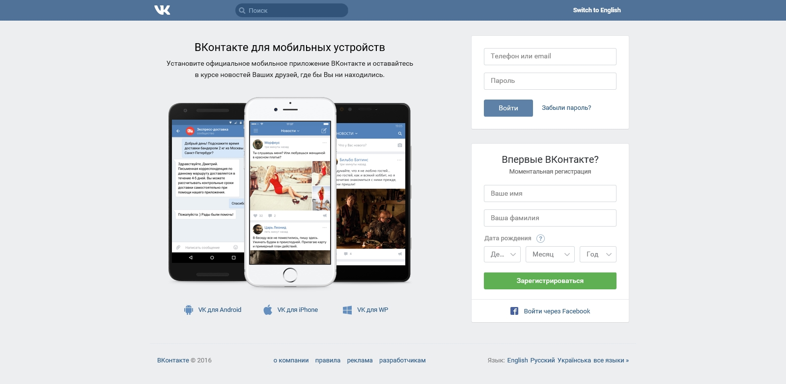
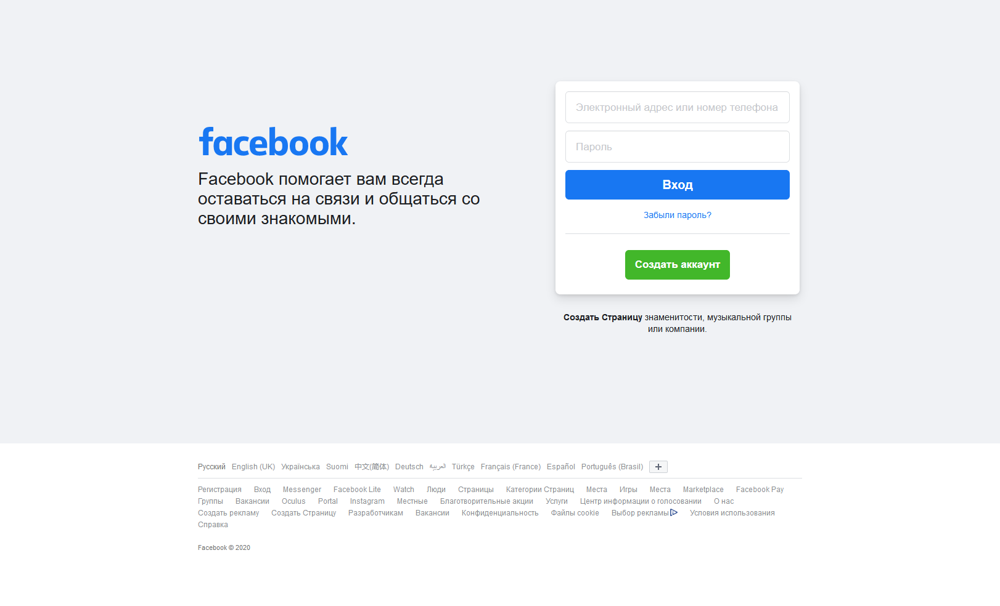
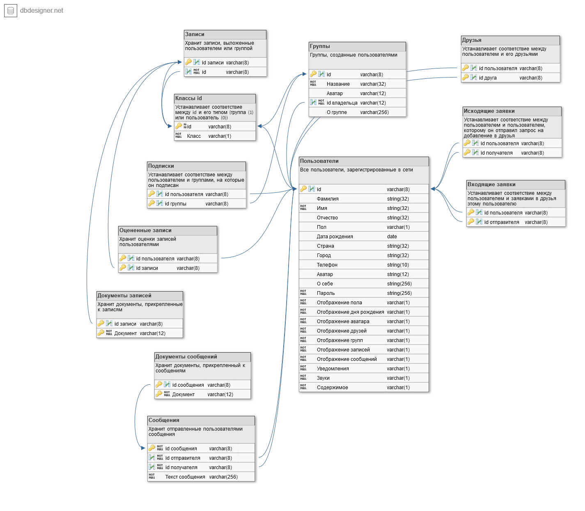

# Пояснительная записка

## 0.Введение

ПИШЕТСЯ В КОНЦЕ

## 1.Анализ ТЗ

### 1.1.Формулировка задания на КР

Целью курсовой работы является проектирование и реализация базы данных "Данные социальной сети". Курсовой проект отражает этапы создания базы данных с использованием СУБД FireBird 2.5, а также клиентского приложения. Для того, чтобы выполнить поставленную цель, были сформулированны следующие задачи:

1. Провести анализ предметной области.
2. Разработать формальные требования к хранимым в БД данным.
3. Разработать структуру БД.
4. Разработать клиентское приложение.

### 1.2.Описание предметной области

Социальная сеть должна реализовывать функционал взаимодействия зарегистрированных в ней пользователей. Поэтому база данных "Данные социальной сети" должна хранить данные, позволяющие обеспечить следующие (необходимые и достаточные для функционирования сети) возможности:

1. Создание, настройка и просмотр (получение данных) личной страницы пользователя. Просмотр предусматривает скрытие некоторых данных в соответствии с настройками приватности. Для данных процессов (не включая настройки приватности) необходимо хранить такие данные, как:
    * Уникальный идентификатор
    * Фамилия
    * Имя
    * Изображение пользователя (аватар)
    * Пол
    * Дата рождения
    * Страна
    * Город
    * Телефон
    * Информация "О себе"
    * Пароль (в зашифрованном виде)
2. Настройки приватности и пользовательского интерфейса. Для этих процессов необходимо хранить следующие данные:
    * Отображение пола (для всех пользователей, всех друзей, никому или избранным пользователям из списка друзей)
    * Отображение даты рождения (аналогичные варианты)
    * Возможность просмотра увеличенного аватара (аналогичные варианты)
    * Возможность просмотра списка друзей (аналогичные варианты)
    * Возможность просмотра списка групп (аналогичные варианты)
    * Возможность просмотра записей на странице (аналогичные варианты)
    * Возможность отправления сообщений (аналогичные варианты)
    * Отображение уведомлений в приложении (отображать или не отображать)
    * Воспроизводить звук уведомлений (воспроизводить или нет)
    * Отображать содержание уведомлений (отображать или скрывать)
3. Взаимодействие пользователя с другими пользователями и личной страницей (за исключением взаимодействия с группами, документами и сообщениями): добавлние новых друзей (с подтверждением со стороны пользователя, которому отправлен запрос на добавление в друзья), удаление друзей (в одностороннем порядке), оценка (оценка может либо быть, либо отсутствовать) записей на страницах других пользователей, добавление записей на свою страницу, загрузка и прикрепление к создаваемой записи аудио, видео, изображения или иного документа. Для этих процессов необходимы такие данные:
    * Список добавленных друзей
    * Список друзей, которым отправлен запрос на добавление в друзья
    * Идентификаторы записей на странице
    * Текст для каждой записи на странице
    * Прикрепленные к каждой записи на странице документы
    * Количество оценок к записи на странице
    * Идентификаторы оцененных записей
4. Взаимодействие пользователей с группами: создание группы, настройка группы (администрирование), добавление записей в группу, загрузка и прикрепление к создаваемым записям документов, оценка записей группы, вступление в группу (не требует подтверждения), выход из группы (не требует подтверждения). Настройки приватности для системы групп не предусматриваются. Для процессов, описанных выше, нужны следующие данные:
    * Уникальный идентификатор
    * Название группы
    * Изображение группы (аватар)
    * Идентификатор пользователя, создавшего группу (только ему доступна возможность выкладывать записи на страницу группы)
    * Список групп, на которые подписан пользователь (для каждого пользователя)
    * Список пользователей, которые подписаны на группу (для каждой группы)
    * Идентификаторы записей на странице
    * Текст для каждой записи на странице
    * Прикрепленные к каждой записи на странице документы
    * Количество оценок к записи на странице
    * Информация "О группе"
5. Взаимодействие пользователей с другими пользователями посредством отправки личных сообщений. Для этого процесса необходимы такие данные:
    * Сообщения (включая указатели на документы), отправленные другому пользователю
    * Документы, отправленные другому пользователю
6. Взаимодействие пользователя с системой документов: загрузка документа напрямую в общее хранилище документов (предусматривается открытый доступ), загрузка документа на страницу, загрузка документа в группу, загрузка документа в личную переписку с другим пользователем. Для перечисленных процессов необходимо хранить следующие данные:
    * Файлы документов, загруженных в общее хранилище, с указанием идентификатора загрузившего
    * Идентификаторы документов, загруженных конкретным пользователем в общее хранилище
    * Файлы документов, загруженных на страницу пользователя
    * Идентификаторы документов, загруженных на страницу пользователя
    * Файлы документов, загруженных на страницу группы
    * Идентификаторы документов, загруженных на страницу группы

Клиентское приложение, реализующее доступ к создаваемой базе данных, должно обеспечивать его с помощью системы страниц:

1. Личная страница
2. Настройки
3. Друзья
4. Поиск пользователей
5. Группы
6. Поиск групп
7. Загруженные (общие) документы
8. Поиск документов

### 1.3.Движение потоков данных

Для обеспечения функционирования социальной сети необходим обмен данных.

Первоначально пользователи создают и настраивают свои страницы. Затем происходят несколько процессов:

* Пользователи добавляют друг друга в друзья, обмениваясь запросами
* Пользователи отправляют друг другу сообщения, обмениваясь текстовой информацией и документами друг с другом
* Пользователи добавляют на свою страницу записи, прикрепляя или не прикрепляя к ним документы, таким образом обмениваясь ими сразу со всеми пользователями, которые могут просматривать эти записи согласно настройкам приватности пользователя, добавившего запись
* Пользователи ставят (либо убирают) оценки на записи на страницах других пользователей, таким образом обмениваясь информацией об одобрении соответствующих записей с остальными пользователями, которые могут видеть эти записи согласно настройкам приватности
* Пользователи добавляют в общее хранилище документы, таким образом обмениваясь ими со всеми
* Пользователи создают группы и добавляют на их стены записи, таким образом обмениваясь ими с подписанными на соответствующие группы пользователями
* Пользователи ставят (либо убирают) оценки  на записи на страницах групп, аким образом обмениваясь информацией об одобрении соответствующих записей с остальными пользователями, которые подписаны на эти группы

### 1.4.Обзор аналогов

#### 1.4.1.ВКонтакте



Рисунок 1 — внешний вид сайта ВКонтакте

ВКонтакте — российская социальная сеть. Сайт особенно популярен среди русскоязычных пользователей. Запущенный 10 октября 2006 года, ресурс изначально позиционировал себя в качестве социальной сети студентов и выпускников российских вузов, позднее стал называть себя «современным, быстрым и эстетичным способом общения в сети». По данным на август 2017 года, среднесуточная аудитория составляет более 80 миллионов посетителей, зарегистрировано более 460 миллионов пользователей. По данным SimilarWeb на сентябрь 2019 года, сайт ВКонтакте занимал 12 место по популярности в мире.

ВКонтакте позволяет:

1. Создавать, настраивать и просматривать личные страницы. Поддерживается описание личной жизни вплоть до образования, карьеры и воинской службы. В качестве средства защиты от нежелательного доступа используется привязка к номеру телефона, пароль, система двухфакторной аутентификации
2. Поддерживается гибкая настройка приватности личной страницы, пользовательского интерфейса в целом и системы уведомлений в частности
3. Взаимодействовать с другими пользователями сети множеством способов: добавлять их в друзья, настраивать родственные связи, отправлять сообщения, приглашения в группы и события и т.д.
4. Создавать и администрировать группы (формально подразделяемые на несколько видов по типу администрирования)
5. Ставить оценки в виде есть оценка - нет оценки ("лайки")

#### 1.4.2.Facebook



Рисунок 2 — внешний вид сайта Facebook

Facebook — крупнейшая социальная сеть в мире. Была основана 4 февраля 2004 года Марком Цукербергом и его соседями по комнате во время обучения в Гарвардском университете. Первоначально веб-сайт был доступен только для студентов Гарвардского университета, затем регистрацию открыли для других университетов Бостона, а затем и для студентов любых учебных учреждений США, имеющих электронный адрес в домене .edu. Начиная с сентября 2006 года сайт доступен для всех пользователей Интернета в возрасте от 13 лет, имеющих адрес электронной почты.

На данный момент Facebook входит в пятёрку наиболее посещаемых веб-сайтов мира. На апрель 2017 года месячная аудитория сети составляет 1,968 миллиарда человек.

Facebook позволяет:

1. Создавать, настраивать и просматривать личные страницы. Поддерживается добавление фотографии, статуса, описания личной жизни и т.д. Есть возможность использования двухфакторной аутентификации
2. Поддерживается гибкая настройка приватности личной страницы, пользовательского интерфейса в целом и системы уведомлений в частности
3. Взаимодействовать с другими пользователями множеством способов: "подмигивать" (создание уведомления другому пользователю для привлечения его внимания к себе), комментировать записи и т.д.
4. Создавать и администрировать группы
5. Ставить оценки в виде 5 классифицируемых реакций (удивление, смех, грусть, гнев и любовь) и стандартной ("лайк")

## 2.Проектировние структуры базы данных

### 2.1.Проектирование предварительных отношений

#### 2.1.1.Пользователи

Для однозначного определения пользователя используется уникальный идентификатор (далее также используется синоним (сокращение от английского identifier) id).

1. Имя сущности - Пользователи
2. Краткое описание - все пользователи, зарегистрированные в социальной сети и информация для их взаимодействия
3. Список атрибутов - id, фамилия, имя, отчество, аватар, пол, дата рождения, страна, город, телефон, о себе, пароль, отображение пола, отображение даты рождения, отображение аватара, отображение друзей, отображение групп, отображение записей, отображение сообщений, уведомления, звуки, содержимое, друзья, исходящие заявки, входящие заявки, подписки, записи, документы, оцененные записи
4. Первичный ключ - id

| Имя атрибута | Краткое описание | Тип данных |
| - | - | - |
| id | Уникальный идентификатор пользователя | Число |
| Фамилия | Часть имени пользователя | Текст |
| Имя | Часть имени пользователя | Текст |
| Отчество | Часть имени пользователя | Текст|
| Аватар | Адрес файла с картинкой-аватаром в файловой системе | Текст |
| Пол | Пол пользователя, 0 - мужской, 1 - женский | Число |
| Дата рождения | Дата рождения пользователя | Дата |
| Страна | Страна проживания | Текст |
| Город | Город проживания | Текст |
| Телефон | Личный номер телефона | Число |
| О себе | Произвольно заполняемая пользователем личная информация | Текст |
| Пароль | Ключевое слово для ограничения доступа к странице | Текст |
| Отображение пола | Отображать ли пол на странице, 0 - видит только владелец страницы, 1 - видят друзья, 2 - видят все | Число |
| Отображение ДР | Отображать ли дату рождения на странице  | Число |
| Отображение аватара | Отображать ли аватар на странице | Число |
| Отображение друзей | Отображать ли список друзей на странице  | Число |
| Отображение групп | Отображать ли список групп на странице | Число |
| Отображение записей | Отображать ли список записей на странице | Число |
| Отображение сообщений | Возможность связаться с пользователем с помощью сообщений | Число |
| Уведомления | Показывать ли пользователю уведомления о входящих сообщениях, 0 - нет, 1 - да | Число |
| Звуки | Воспроизводить ли звук уведомления | Число |
| Содержимое | Отображать ли текст уведомления | Число |
| Друзья | Список id друзей | Число |
| Исходящие заявки | Исходящие заявки на добавление в друзья (id пользователей) | Число |
| Входящие заявки | Входящие заявки на добавление в друзья (id пользователей) | Число |
| Подписки | Список id групп, на которые подписан пользователь | Число |
| Записи | Текст записей на странице пользователя | Текст |
| Документы | Документы, прикрепленные к определенной записи на странице | Текст |
| Оцененные записи | Записи пользователей и групп, которые оценил пользователь | Число |

#### 2.1.2.Группы

Для однозначного определения группы используется уникальный идентификатор. Он не может совпадать с любым идентификатором пользователя, но кодируется также 8 цифрами.

Заметим, что в этом случае необходимо устанавливать соответствие между идендификатором и сущностью, на которую он ссылается, поскольку иначе невозможно однозначно определить, какой сущности принадлежит конкретный id - пользователю или группе. Такое соответствие выразим в виде отдельного отношения:

#### 2.1.3.Классы id

| Имя атрибута | Краткое описание | Тип данных |
| - | - | - |
| id | Уникальный идентификатор (группы или пользователя) | Число |
| Класс | Класс идентификатора - пользователи (0) или группы (1) | Число |

1. Имя сущности - Группы
2. Краткое описание - все группы, зарегистрированные пользователями в социальной сети и список ее подписчиков
3. Список атрибутов - id, название, аватар, id владельца, о группе, записи, документы
4. Первичный ключ - id

| Имя атрибута | Краткое описание | Тип данных |
| - | - | - |
| id | Уникальный идентификатор группы | Число |
| Название | Имя группы | Текст |
| Аватар | Адрес файла с картинкой-аватаром в файловой системе | Текст |
| id владельца | Уникальный идентификатор пользователя | Число |
| О группе | Произвольно заполняемая пользователем информация о тематике группы | Текст |
| Записи | Текст записей на странице группы | Текст |
| Документы | Документы, прикрепленные к определенной записи на странице | Текст |

#### 2.1.4.Сообщения

1. Имя сущности - Сообщения
2. Краткое описание - все сообщения, отправленные пользователями
3. Список атрибутов - id сообщения, id отправителя, id получателя, текст сообщения, документы
4. Первичный ключ - id сообщения

| Имя атрибута | Краткое описание | Тип данных |
| - | - | - |
| id сообщения | Уникальный идентификатор сообщения | Число |
| id отправителя | id пользователя, отправившего сообщение | Число |
| id получателя | id пользователя, которому предназначено сообщение | Число |
| Текст сообщения | Содержимое сообщения | Текст |
| Документы | Прикрепленные к сообщению документы (адрес) | Текст |

### 2.2.Приведение базы данных к первой нормальной форме

Определение: отношение находится в первой нормальной форме, если все его атрибуты являются простыми (имеют единственное значение).

Первая сущность (Пользователи) не удовлетворяет первой нормальной форме, поскольку атрибуты друзья, исходящие заявки, входящие заявки, подписки, записи, документы и оцененные записи порождают явную избыточность. Например, для каждой записи пользователя необходимо будет создавать отдельную запись с одинаковым id пользователя. Для избавления от явной избыточности проведем над отношением операции проекции. Получим следующие таблицы:

#### 2.2.1.Пользователь

| Имя атрибута | Краткое описание | Тип данных |
| - | - | - |
| id | Уникальный идентификатор пользователя | Число |
| Фамилия | Часть имени пользователя | Текст |
| Имя | Часть имени пользователя | Текст |
| Отчество | Часть имени пользователя | Текст |
| Аватар | Адрес файла с картинкой-аватаром в файловой системе | Текст |
| Пол | Пол пользователя, 0 - мужской, 1 - женский | Число |
| Дата рождения | Дата рождения пользователя | Дата |
| Страна | Страна проживания | Текст |
| Город | Город проживания | Текст |
| Телефон | Личный номер телефона | Число |
| О себе | Произвольно заполняемая пользователем личная информация | Текст |
| Пароль | Ключевое слово для ограничения доступа к странице | Текст |
| Отображение пола | Отображать ли пол на странице, 0 - видит только владелец страницы, 1 - видят друзья, 2 - видят все | Число |
| Отображение ДР | Отображать ли дату рождения на странице  | Число |
| Отображение аватара | Отображать ли аватар на странице | Число |
| Отображение друзей | Отображать ли список друзей на странице  | Число |
| Отображение групп | Отображать ли список групп на странице | Число |
| Отображение записей | Отображать ли список записей на странице | Число |
| Отображение сообщений | Возможность связаться с пользователем с помощью сообщений | Число |
| Уведомления | Показывать ли пользователю уведомления о входящих сообщениях, 0 - нет, 1 - да | Число |
| Звуки | Воспроизводить ли звук уведомления | Число |
| Содержимое | Отображать ли текст уведомления | Число |

#### 2.2.2.Друзья

| Имя атрибута | Краткое описание | Тип данных |
| - | - | - |
| id пользователя | id пользователя | Число |
| id друга | Один друг из списка друзей | Число |

#### 2.2.3.Исходящие заявки

| Имя атрибута | Краткое описание | Тип данных |
| - | - | - |
| id пользователя | id пользователя | Число |
| id получателя | Исходящая заявка на добавление в друзья (id пользователя, которому отправлена заявка данным пользователем) | Число |

#### 2.2.3.Входящие заявки

| Имя атрибута | Краткое описание | Тип данных |
| - | - | - |
| id пользователя | id пользователя | Число |
| id получателя | Входящая заявка на добавление в друзья (id пользователя, который отправил заявку данному пользователю) | Число |

#### 2.2.4.Подписки

| Имя атрибута | Краткое описание | Тип данных |
| - | - | - |
| id пользователя | id пользователя | Число |
| id группы | id группы, на которую подписан пользователь | Число |

#### 2.2.5.Записи пользователя

| Имя атрибута | Краткое описание | Тип данных |
| - | - | - |
| id пользователя | id пользователя | Число |
| id записи | Выложенная на странице пользователя запись | Текст |

#### 2.2.6.Документы пользователя

| Имя атрибута | Краткое описание | Тип данных |
| - | - | - |
| id записи | id выложенной на странице пользователя записи | Число |
| Документ | Документ, прикрепленные к записи на странице пользователя | Текст |

#### 2.2.7.Оцененные записи

| Имя атрибута | Краткое описание | Тип данных |
| - | - | - |
| id пользователя | id пользователя | Число |
| id записи | Выложенная на странице пользователя или группы запись | Число |

Вторая сущность (Группы) не удовлетворяет первой нормальной форме, поскольку атрибуты записи и документы порождают явную избыточность. Например, для каждой записи группы необходимо будет создавать отдельную запись с одинаковым id группы. Для избавления от явной избыточности проведем над отношением операции проекции. Получим следующие таблицы:

#### 2.2.8.Группы

| Имя атрибута | Краткое описание | Тип данных |
| - | - | - |
| id | Уникальный идентификатор группы | Число |
| Название | Имя группы | Текст |
| Аватар | Адрес файла с картинкой-аватаром в файловой системе | Текст |
| id владельца | Уникальный идентификатор пользователя | Число |
| О группе | Произвольно заполняемая пользователем информация о тематике группы | Текст |

#### 2.2.9.Записи

Заметим, что отношение "Записи пользователя", созданное ранее, имеет такую же структуру, за единственным отличием - в ней ставятся в соответствие пользователь и записи, а не группа и записи. Поскольку каждый идентификатор и группы, и пользователя уникален (не существует пользователя и группы с одинаковым идентификатором), можно хранить записи группы в том же отношении. Преобразуем в соответствии с этим утверждением созданную таблицу "Записи пользователя" для хранения записей группы.

| Имя атрибута | Краткое описание | Тип данных |
| - | - | - |
| id | id пользователя или группы | Число |
| id записи | Выложенная на странице пользователя или группы запись | Текст |

#### 2.2.10.Документы

Аналогично с отношением "Записи", преобразуем созданное отношение "Документы пользователя" для хранения документов группы.

| Имя атрибута | Краткое описание | Тип данных |
| - | - | - |
| id записи | id выложенной на странице пользователя или группы записи | Число |
| Документ | Документ, прикрепленные к записи на стене пользователя или группы | Текст |

Третья сущность (Сообщения) не удовлетворяет первой нормальной форме, поскольку атрибут документы порождают явную избыточность. Например, для каждого документа, прикрепленного к сообщению, необходимо будет создавать отдельную запись с одинаковым id сообщения. Для избавления от явной избыточности проведем над отношением операции проекции. Получим следующие таблицы:

#### 2.2.11.Сообщения

| Имя атрибута | Краткое описание | Тип данных |
| - | - | - |
| id сообщения | Уникальный идентификатор сообщения | Число |
| id отправителя | id пользователя, отправившего сообщение | Число |
| id получателя | id пользователя, которому предназначено сообщение | Число |
| Текст сообщения | Содержимое сообщения | Текст |

#### 2.2.12.Документы сообщений

| Имя атрибута | Краткое описание | Тип данных |
| - | - | - |
| id сообщения | id отправленного сообщения | Число |
| Документ | Документ, прикрепленные к сообщению | Текст |

### 2.3.Приведение базы данных ко второй нормальной форме

Определение: отношеение находится во второй нормальной форме, если оно находится в первой нормальной форме и каждый неключевой атрибут функционально полно зависит от первичного ключа.

#### 2.3.1.Пользователь

Отношение остается без изменений, поскольку неключевые атрибуты функционально полно зависят от первичного ключа id (то есть, каждому неключевому атрибуту соответствует одно значение ключевого).

| Имя атрибута | Краткое описание | Тип данных | Первичный ключ |
| - | - | - | - |
| id | Уникальный идентификатор пользователя | Число | + |
| Фамилия | Часть имени пользователя | Текст |  |
| Имя | Часть имени пользователя | Текст |  |
| Отчество | Часть имени пользователя | Текст |  |
| Аватар | Адрес файла с картинкой-аватаром в файловой системе | Текст |  |
| Пол | Пол пользователя, 0 - мужской, 1 - женский | Число |  |
| Дата рождения | Дата рождения пользователя | Дата |  |
| Страна | Страна проживания | Текст |  |
| Город | Город проживания | Текст |  |
| Телефон | Личный номер телефона | Число |  |
| О себе | Произвольно заполняемая пользователем личная информация | Текст |  |
| Пароль | Ключевое слово для ограничения доступа к странице | Текст |  |
| Отображение пола | Отображать ли пол на странице, 0 - видит только владелец страницы, 1 - видят друзья, 2 - видят все | Число |  |
| Отображение ДР | Отображать ли дату рождения на странице  | Число |  |
| Отображение аватара | Отображать ли аватар на странице | Число |  |
| Отображение друзей | Отображать ли список друзей на странице  | Число |  |
| Отображение групп | Отображать ли список групп на странице | Число |  |
| Отображение записей | Отображать ли список записей на странице | Число |  |
| Отображение сообщений | Возможность связаться с пользователем с помощью сообщений | Число |  |
| Уведомления | Показывать ли пользователю уведомления о входящих сообщениях, 0 - нет, 1 - да | Число |  |
| Звуки | Воспроизводить ли звук уведомления | Число |  |
| Содержимое | Отображать ли текст уведомления | Число |  |

#### 2.3.2.Друзья

Оба атрибута данного отношения являются первичными, значит, неключевых атрибутов нет, что соответствует второй нормальной форме.

| Имя атрибута | Краткое описание | Тип данных | Первичный ключ |
| - | - | - | - |
| id пользователя | id пользователя | Число | + |
| id друга | Один друг из списка друзей | Число | + |

#### 2.3.3.Исходящие заявки

Оба атрибута данного отношения являются первичными, значит, неключевых атрибутов нет, что соответствует второй нормальной форме.

| Имя атрибута | Краткое описание | Тип данных | Первичный ключ |
| - | - | - | - |
| id пользователя | id пользователя | Число | + |
| id получателя | Исходящая заявка на добавление в друзья (id пользователя, которому отправлена заявка данным пользователем) | Число | + |

#### 2.3.3.Входящие заявки

Оба атрибута данного отношения являются первичными, значит, неключевых атрибутов нет, что соответствует второй нормальной форме.

| Имя атрибута | Краткое описание | Тип данных | Первичный ключ |
| - | - | - | - |
| id пользователя | id пользователя | Число | + |
| id отправителя | Входящая заявка на добавление в друзья (id пользователя, который отправил заявку данному пользователю) | Число | + |

#### 2.3.4.Подписки

Оба атрибута данного отношения являются первичными, значит, неключевых атрибутов нет, что соответствует второй нормальной форме.

| Имя атрибута | Краткое описание | Тип данных | Первичный ключ |
| - | - | - | - |
| id пользователя | id пользователя | Число | + |
| id группы | id группы, на которую подписан пользователь | Число | + |

#### 2.3.5.Оцененные записи

Оба атрибута данного отношения являются первичными, значит, неключевых атрибутов нет, что соответствует второй нормальной форме.

| Имя атрибута | Краткое описание | Тип данных | Первичный ключ |
| - | - | - | - |
| id пользователя | id пользователя | Число | + |
| id записи | Выложенная на странице пользователя или группы запись | Число | + |

#### 2.2.6.Группы

Отношение остается без изменений, поскольку неключевые атрибуты функционально полно зависят от первичного ключа id (то есть, каждому неключевому атрибуту соответствует одно значение ключевого).

| Имя атрибута | Краткое описание | Тип данных | Первичный ключ |
| - | - | - | - |
| id | Уникальный идентификатор группы | Число | + |
| Название | Имя группы | Текст |  |
| Аватар | Адрес файла с картинкой-аватаром в файловой системе | Текст |  |
| id владельца | Уникальный идентификатор пользователя | Число |  |
| О группе | Произвольно заполняемая пользователем информация о тематике группы | Текст |  |

#### 2.3.7.Записи

Отношение остается без изменений, поскольку неключевой атрибут функционально полно зависит от первичного ключа id записи (то есть, id пользователя/группы соответствует одно значение id записи).

| Имя атрибута | Краткое описание | Тип данных | Первичный ключ |
| - | - | - | - |
| id записи | Выложенная на странице пользователя или группы запись | Текст | + |
| id | id пользователя или группы | Число |  |

#### 2.3.8.Документы

Оба атрибута данного отношения являются первичными, значит, неключевых атрибутов нет, что соответствует второй нормальной форме.

| Имя атрибута | Краткое описание | Тип данных | Первичный ключ |
| - | - | - | - |
| id записи | id выложенной на странице пользователя или группы записи | Число | + |
| Документ | Документ, прикрепленные к записи на стене пользователя или группы | Текст | + |

#### 2.3.9.Сообщения

Отношение остается без изменений, поскольку неключевые атрибуты функционально полно зависят от первичного ключа id (то есть, каждому неключевому атрибуту соответствует одно значение ключевого).

| Имя атрибута | Краткое описание | Тип данных | Первичный ключ |
| - | - | - | - |
| id сообщения | Уникальный идентификатор сообщения | Число | + |
| id отправителя | id пользователя, отправившего сообщение | Число |  |
| id получателя | id пользователя, которому предназначено сообщение | Число |  |
| Текст сообщения | Содержимое сообщения | Текст |  |

#### 2.3.10.Документы сообщений

Оба атрибута данного отношения являются первичными, значит, неключевых атрибутов нет, что соответствует второй нормальной форме.

| Имя атрибута | Краткое описание | Тип данных | Первичный ключ |
| - | - | - | - |
| id сообщения | id отправленного сообщения | Число | + |
| Документ | Документ, прикрепленные к сообщению | Текст | + |

#### 2.1.10.Классы id

Отношение остается без изменений, поскольку неключевые атрибуты функционально полно зависят от первичного ключа id (то есть, каждому неключевому атрибуту соответствует одно значение ключевого).

| Имя атрибута | Краткое описание | Тип данных | Первичный ключ |
| - | - | - | - |
| id | Уникальный идентификатор (группы или пользователя) | Число | + |
| Класс | Класс идентификатора - пользователи (0) или группы (1) | Число | |

### 2.4.Приведение базы данных к третьей нормальной форме

Определение: отношение находится в третьей нормальной форме, если оно находится во второй нормальной форме и каждый неключевой атрибут нетранзитивно зависит от первичного ключа.

Ни в одном из описанный выше отношений нет транзитивных зависимостей между атрибутами.

Значит, база данных соответствует третьей нормальной форме.

## 2.5.Проектирование логической структуры базы данных

Логическая структура базы данных отображает таблицы базы данных, по каким атрибутам осуществляется взаимосвязь отношений и атрибуты таблиц с указанием первичных и внешних ключей.



Рисунок 3 — логическая структура базы данных

Для формирования приведенных отношений можно использовать следующий запрос:

```sql
CREATE TABLE `Пользователи` (
	`id` varchar(8) NOT NULL AUTO_INCREMENT,
	`Фамилия` VARCHAR(32),
	`Имя` VARCHAR(32) NOT NULL,
	`Отчество` VARCHAR(32),
	`Пол` varchar(1),
	`Дата рождения` DATE,
	`Страна` VARCHAR(32),
	`Город` VARCHAR(32),
	`Телефон` VARCHAR(10),
	`Аватар` VARCHAR(12),
	`О себе` VARCHAR(256),
	`Пароль` VARCHAR(256) NOT NULL,
	`Отображение пола` varchar(1) NOT NULL,
	`Отображение дня рождения` varchar(1) NOT NULL,
	`Отображение аватара` varchar(1) NOT NULL,
	`Отображение друзей` varchar(1) NOT NULL,
	`Отображение групп` varchar(1) NOT NULL,
	`Отображение записей` varchar(1) NOT NULL,
	`Отображение сообщений` varchar(1) NOT NULL,
	`Уведомления` varchar(1) NOT NULL,
	`Звуки` varchar(1) NOT NULL,
	`Содержимое` varchar(1) NOT NULL,
	PRIMARY KEY (`id`)
);

CREATE TABLE `Друзья` (
	`id пользователя` varchar(8) NOT NULL AUTO_INCREMENT,
	`id друга` varchar(8) NOT NULL AUTO_INCREMENT,
	PRIMARY KEY (`id пользователя`,`id друга`)
);

CREATE TABLE `Исходящие заявки` (
	`id пользователя` varchar(8) NOT NULL AUTO_INCREMENT,
	`id получателя` varchar(8) NOT NULL AUTO_INCREMENT,
	PRIMARY KEY (`id пользователя`,`id получателя`)
);

CREATE TABLE `Входящие заявки` (
	`id пользователя` varchar(8) NOT NULL AUTO_INCREMENT,
	`id отправителя` varchar(8) NOT NULL AUTO_INCREMENT,
	PRIMARY KEY (`id пользователя`,`id отправителя`)
);

CREATE TABLE `Классы id` (
	`id` varchar(8) NOT NULL AUTO_INCREMENT,
	`Класс` varchar(1) NOT NULL,
	PRIMARY KEY (`id`)
);

CREATE TABLE `Группы` (
	`id` varchar(8) NOT NULL AUTO_INCREMENT,
	`Название` varchar(32) NOT NULL,
	`Аватар` varchar(12),
	`id владельца` varchar(12) NOT NULL,
	`О группе` varchar(256),
	PRIMARY KEY (`id`)
);

CREATE TABLE `Записи` (
	`id записи` varchar(8) NOT NULL AUTO_INCREMENT,
	`id` varchar(8) NOT NULL,
	PRIMARY KEY (`id записи`)
);

CREATE TABLE `Подписки` (
	`id пользователя` varchar(8) NOT NULL,
	`id группы` varchar(8) NOT NULL,
	PRIMARY KEY (`id пользователя`,`id группы`)
);

CREATE TABLE `Оцененные записи` (
	`id пользователя` varchar(8) NOT NULL,
	`id записи` varchar(8) NOT NULL,
	PRIMARY KEY (`id пользователя`,`id записи`)
);

CREATE TABLE `Документы записей` (
	`id записи` varchar(8) NOT NULL,
	`Документ` varchar(12) NOT NULL,
	PRIMARY KEY (`id записи`,`Документ`)
);

CREATE TABLE `Сообщения` (
	`id сообщения` varchar(8) NOT NULL AUTO_INCREMENT,
	`id отправителя` varchar(8) NOT NULL,
	`id получателя` varchar(8) NOT NULL,
	`Текст сообщения` varchar(256) NOT NULL,
	PRIMARY KEY (`id сообщения`)
);

CREATE TABLE `Документы сообщений` (
	`id сообщения` varchar(8) NOT NULL,
	`Документ` varchar(12) NOT NULL,
	PRIMARY KEY (`id сообщения`,`Документ`)
);

ALTER TABLE `Пользователи` ADD CONSTRAINT `Пользователи_fk0` FOREIGN KEY (`id`) REFERENCES `Классы id`(`id`);

ALTER TABLE `Друзья` ADD CONSTRAINT `Друзья_fk0` FOREIGN KEY (`id пользователя`) REFERENCES `Пользователи`(`id`);

ALTER TABLE `Друзья` ADD CONSTRAINT `Друзья_fk1` FOREIGN KEY (`id друга`) REFERENCES `Пользователи`(`id`);

ALTER TABLE `Исходящие заявки` ADD CONSTRAINT `Исходящие заявки_fk0` FOREIGN KEY (`id пользователя`) REFERENCES `Пользователи`(`id`);

ALTER TABLE `Исходящие заявки` ADD CONSTRAINT `Исходящие заявки_fk1` FOREIGN KEY (`id получателя`) REFERENCES `Пользователи`(`id`);

ALTER TABLE `Входящие заявки` ADD CONSTRAINT `Входящие заявки_fk0` FOREIGN KEY (`id пользователя`) REFERENCES `Пользователи`(`id`);

ALTER TABLE `Входящие заявки` ADD CONSTRAINT `Входящие заявки_fk1` FOREIGN KEY (`id отправителя`) REFERENCES `Пользователи`(`id`);

ALTER TABLE `Группы` ADD CONSTRAINT `Группы_fk0` FOREIGN KEY (`id`) REFERENCES `Классы id`(`id`);

ALTER TABLE `Группы` ADD CONSTRAINT `Группы_fk1` FOREIGN KEY (`id владельца`) REFERENCES `Пользователи`(`id`);

ALTER TABLE `Записи` ADD CONSTRAINT `Записи_fk0` FOREIGN KEY (`id записи`) REFERENCES `Классы id`(`id`);

ALTER TABLE `Записи` ADD CONSTRAINT `Записи_fk1` FOREIGN KEY (`id`) REFERENCES `Классы id`(`id`);

ALTER TABLE `Подписки` ADD CONSTRAINT `Подписки_fk0` FOREIGN KEY (`id пользователя`) REFERENCES `Пользователи`(`id`);

ALTER TABLE `Подписки` ADD CONSTRAINT `Подписки_fk1` FOREIGN KEY (`id группы`) REFERENCES `Группы`(`id`);

ALTER TABLE `Оцененные записи` ADD CONSTRAINT `Оцененные записи_fk0` FOREIGN KEY (`id пользователя`) REFERENCES `Пользователи`(`id`);

ALTER TABLE `Оцененные записи` ADD CONSTRAINT `Оцененные записи_fk1` FOREIGN KEY (`id записи`) REFERENCES `Записи`(`id записи`);

ALTER TABLE `Документы записей` ADD CONSTRAINT `Документы записей_fk0` FOREIGN KEY (`id записи`) REFERENCES `Записи`(`id записи`);

ALTER TABLE `Сообщения` ADD CONSTRAINT `Сообщения_fk0` FOREIGN KEY (`id отправителя`) REFERENCES `Пользователи`(`id`);

ALTER TABLE `Сообщения` ADD CONSTRAINT `Сообщения_fk1` FOREIGN KEY (`id получателя`) REFERENCES `Пользователи`(`id`);

ALTER TABLE `Документы сообщений` ADD CONSTRAINT `Документы сообщений_fk0` FOREIGN KEY (`id сообщения`) REFERENCES `Сообщения`(`id сообщения`);

```
